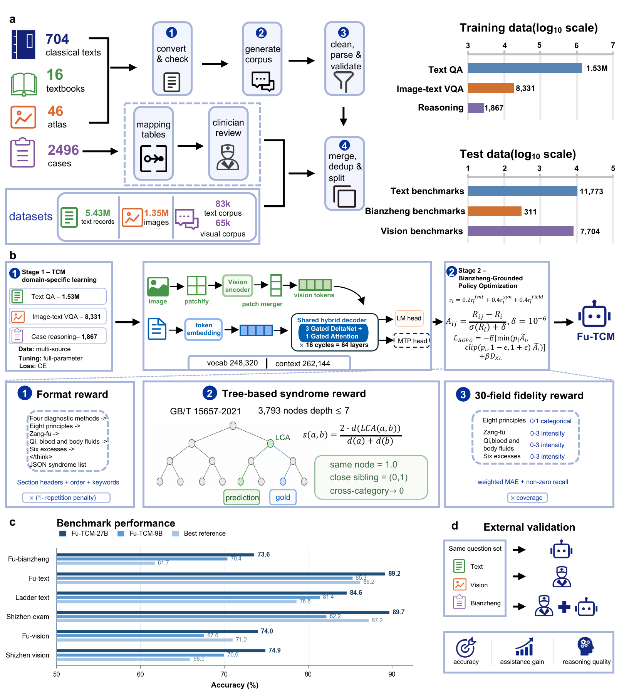

<h1 align="center">Fu-TCM: a multimodal large language model that learns traditional Chinese medicine diagnostic reasoning</h1>

<p align="center">
  🤗 <a href="https://huggingface.co/fudanxai/Fu-TCM-9B">Fu-TCM-9B</a> |
  🤗 <a href="https://huggingface.co/fudanxai/Fu-TCM-27B">Fu-TCM-27B</a>
</p>

## Overview

FU-TCM is a multimodal large-language-model family for Traditional Chinese Medicine (TCM), trained on approximately **7.12 million examples** derived from classical texts, textbooks, medical images, clinical cases, and public datasets. It is designed to connect evidence from the four diagnostic methods to explicit intermediate *bianzheng* fields and a final syndrome prediction.

Training proceeds in two stages. **TCM domain-specific learning** uses text QA, image-text VQA, and case-reasoning examples to establish TCM knowledge, multimodal understanding, and structured reasoning. **Bianzheng-Grounded Policy Optimization (BGPO)** then optimizes response format, tree-based syndrome consistency, and fidelity across 30 intermediate *bianzheng* fields.

<p align="center">
  <a href="assets/fu-tcm-framework-overview.png">
    
  </a>
</p>

<p align="center"><em>FU-TCM framework: multisource data construction, two-stage training, benchmark performance, and external validation.</em></p>

## Key Features

- 🧠 **From knowledge to *bianzheng*.** Fu-TCM shifts TCM large-model training from knowledge accumulation toward learning how clinical evidence is organized into *bianzheng* decisions.
- 🔎 **Multimodal four-examination reasoning.** A unified architecture integrates evidence from the four diagnostic methods and generates a complete, traceable evidence-to-syndrome chain for clinician review.
- 📊 **Process–outcome evaluation.** A dual-dimensional evaluation system measures both final predictions and the intermediate *bianzheng* process. Fu-TCM achieves state-of-the-art results across six benchmarks and professional-level external validation.
- 🔓 **Computable and open TCM knowledge.** TCM *bianzheng* experience is encoded as 30 learnable fields and a syndrome taxonomy, while open data, code, and model weights lower the cost of reuse and accelerate international research.

## 🚀 Model Zoo

We provide two model variants with different parameter scales:

| Model | Parameters | Base Model | Hugging Face |
| --- | ---: | --- | --- |
| **Fu-TCM-9B** | 9B | Qwen3.5-9B | [🤗 Link](https://huggingface.co/fudanxai/Fu-TCM-9B) |
| **Fu-TCM-27B** | 27B | Qwen3.6-27B | [🤗 Link](https://huggingface.co/fudanxai/Fu-TCM-27B) |

## 🏆 Performance Highlights

### TCM Reasoning, Text, and Vision Benchmarks

Accuracy comparison across six benchmarks. **Bold** indicates Fu-TCM models; macro averages include only models with results on all six benchmarks.

| Model | Fu-bianzheng | Fu-text | Ladder text | Shizhen exam | Fu-vision | Shizhen vision | Macro avg. |
| --- | ---: | ---: | ---: | ---: | ---: | ---: | ---: |
| Qwen3.5-9B | 49.52 | 73.00 | 65.63 | 67.00 | 62.40 | 57.93 | 62.58 |
| Qwen3.5-27B | 52.41 | 76.90 | 74.05 | 75.46 | 65.40 | 61.22 | 67.57 |
| Qwen3.6-27B | 60.77 | 78.70 | 72.81 | 75.55 | 62.80 | 61.95 | 68.76 |
| DeepSeek-V4-Pro | 56.59 | 78.10 | 75.37 | — | — | — | — |
| Kimi-K2.6 | 61.09 | 81.70 | 77.55 | 80.79 | 67.60 | 65.24 | 72.33 |
| Qwen3.7-Max | 61.74 | 84.30 | 78.15 | 82.17 | 71.00 | 65.89 | 73.88 |
| GLM-5.2 | 56.91 | 78.00 | 75.10 | — | — | — | — |
| GPT-5.5 | 55.95 | 84.20 | 78.63 | 87.22 | 64.20 | 65.95 | 72.69 |
| Claude-Opus-4.8 | 59.16 | 86.20 | 76.59 | 81.62 | 70.40 | 65.02 | 73.16 |
| **Fu-TCM-9B** | **70.42** | **85.30** | **81.35** | **82.17** | **67.60** | **70.00** | **76.14** |
| **Fu-TCM-27B** | **73.63** | **89.20** | **84.57** | **89.71** | **74.00** | **74.93** | **81.01** |

## 🛠️ Installation

```bash
# Clone the repository
git clone https://github.com/HC-Guo/FU-TCM.git
cd FU-TCM

# Create the Conda environment
conda create -n fu-tcm python=3.12 -y
conda activate fu-tcm

# Install PyTorch for CUDA 12.8
pip install torch==2.11.0 torchvision==0.26.0 torchaudio==2.11.0 \
  --index-url https://download.pytorch.org/whl/cu128

# Install FlashAttention
pip install flash-attn==2.8.3 --no-build-isolation

# Install the project dependencies
pip install -r requirements.txt
```

## 💻 Quick Start

```python
import torch
from transformers import AutoProcessor, Qwen3_5ForConditionalGeneration

model_id = "fudanxai/Fu-TCM-9B"

processor = AutoProcessor.from_pretrained(
    model_id,
    trust_remote_code=True,
)
model = Qwen3_5ForConditionalGeneration.from_pretrained(
    model_id,
    trust_remote_code=True,
    torch_dtype=torch.bfloat16,
    device_map="auto",
    attn_implementation="flash_attention_2",
).eval()

messages = [
    {
        "role": "user",
        "content": "请根据四诊信息分析患者的中医证型，并说明辨证依据。",
    }
]

text = processor.apply_chat_template(
    messages,
    tokenize=False,
    add_generation_prompt=True,
    enable_thinking=False,
)
inputs = processor(text=text, return_tensors="pt").to(model.device)

with torch.inference_mode():
    generated_ids = model.generate(
        **inputs,
        max_new_tokens=512,
        do_sample=False,
    )

input_length = inputs["input_ids"].shape[1]
response = processor.decode(
    generated_ids[0][input_length:],
    skip_special_tokens=True,
)
print(response)
```
