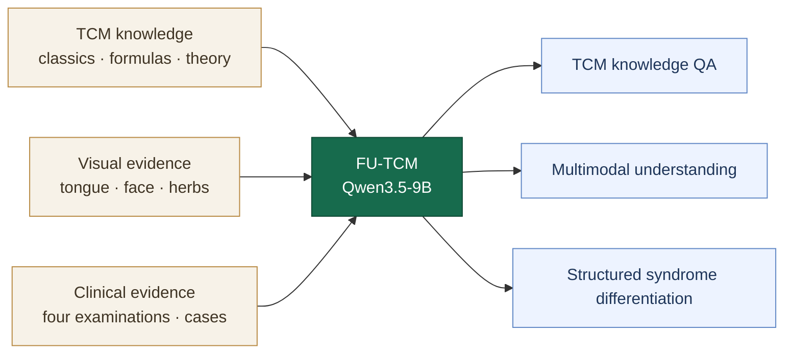

<h1 align="center">FU-TCM</h1>

<p align="center">
  <strong>A Multimodal Large Language Model for Traditional Chinese Medicine</strong><br>
  面向中医知识理解、多模态诊察与辨证推理的中医大模型
</p>

<p align="center">
  
  
  
  
</p>

<p align="center">
  <a href="index.html">项目主页</a> ·
  <a href="docs/model_overview.md">模型说明</a> ·
  <a href="docs/training_overview.md">训练方法</a> ·
  <a href="docs/sft_grpo_evaluation.html">评测</a>
</p>

## Overview

FU-TCM 是面向传统中医药知识与临床辨证任务训练的多模态大语言模型。当前训练版本以 **Qwen3.5-9B** 为基座，通过中医领域全参数监督微调和 GRPO 推理对齐，使模型能够结合古籍与教材知识、舌诊和面诊等图像信息，以及临床四诊证据完成中医问答与结构化辨证推理。

本仓库重点提供 FU-TCM 的模型训练、推理对齐、推理和评测代码。

### Key features

- **中医知识理解**：覆盖古籍、方药、医理、教材知识与临床问答。
- **多模态诊察理解**：处理文本与图像输入，重点支持舌诊、面诊、中药图像及医学图文问答。
- **结构化辨证推理**：从望、闻、问、切信息出发，分析八纲、脏腑、气血津液与病因要素，并输出证型判断。
- **领域推理对齐**：在全参数 SFT 后使用 GRPO，以格式、证型和辨证参数奖励约束模型输出。
- **双推理后端评测**：提供 Transformers 与 vLLM 评测入口，并支持文本、视觉题目和医生盲测。

## Model at a glance

| Item | FU-TCM configuration |
| --- | --- |
| Base model | Qwen3.5-9B |
| Modalities | Text and image |
| Supervised training | Full-parameter SFT, bf16, DeepSpeed ZeRO-3 |
| Context length | 4,096 tokens in the current SFT configuration |
| Reasoning alignment | verl GRPO |
| Reward design | 20% format, 40% syndrome, 40% structured differentiation |
| Evaluation | Transformers, vLLM, text/vision benchmarks, doctor blind review |

## Model capabilities



## Training

FU-TCM uses a two-stage domain alignment recipe:

1. **Multimodal full-parameter SFT** adapts Qwen3.5-9B to TCM knowledge, visual question answering, clinical cases, and structured reasoning instructions.
2. **GRPO reasoning alignment** rewards valid reasoning structure, syndrome agreement, and quantitative consistency across eight-principle, organ, qi-blood-fluid, and pathogenic-factor judgments.

The current SFT configuration uses LLaMA-Factory, DeepSpeed ZeRO-3, bf16 training, gradient checkpointing, and a cosine learning-rate schedule. GRPO training is implemented with verl and a project-specific reward function.

### Start model training

```bash
git clone https://github.com/HC-Guo/FU-TCM.git
cd FU-TCM/sft_grpo_training_evaluation

bash llamafactory_qwen35/scripts/setup_llamafactory_env.sh
conda activate qwen35_ft
bash llamafactory_qwen35/scripts/train_full_ds3.sh
```

If Conda is unavailable, the setup script creates `.venv_qwen35_ft`; activate that environment before starting training.

The main SFT configuration is [`qwen35_9b_full_sft_ds3.yaml`](sft_grpo_training_evaluation/llamafactory_qwen35/qwen35_9b_full_sft_ds3.yaml). GRPO launch examples are provided in [`run_tcm_grpo_smoke.sh`](sft_grpo_training_evaluation/run_tcm_grpo_smoke.sh) and [`run_tcm_grpo_smoke_hf.sh`](sft_grpo_training_evaluation/run_tcm_grpo_smoke_hf.sh).

## Evaluation

```bash
cd sft_grpo_training_evaluation

# Transformers
TCM_MODEL_PATH=/path/to/FU-TCM python eval_qwen35.py

# vLLM
TCM_MODEL_PATH=/path/to/FU-TCM python eval_qwen35_vllm.py
```

The evaluation code reports overall, dataset-level, and category-level accuracy. The benchmark utilities can also produce blinded question sets and answer sheets for clinician review.

## Model code

| Component | Path |
| --- | --- |
| Full SFT configuration | [`sft_grpo_training_evaluation/llamafactory_qwen35/`](sft_grpo_training_evaluation/llamafactory_qwen35/) |
| GRPO reward | [`sft_grpo_training_evaluation/reward_functions.py`](sft_grpo_training_evaluation/reward_functions.py) |
| GRPO data interface | [`sft_grpo_training_evaluation/convert_bianzheng_to_verl_grpo.py`](sft_grpo_training_evaluation/convert_bianzheng_to_verl_grpo.py) |
| Transformers evaluation | [`sft_grpo_training_evaluation/eval_qwen35.py`](sft_grpo_training_evaluation/eval_qwen35.py) |
| vLLM evaluation | [`sft_grpo_training_evaluation/eval_qwen35_vllm.py`](sft_grpo_training_evaluation/eval_qwen35_vllm.py) |
| Doctor blind evaluation | [`sft_grpo_training_evaluation/benchmark_tools/`](sft_grpo_training_evaluation/benchmark_tools/) |

## Documentation

| Guide | Contents |
| --- | --- |
| [Model overview](docs/model_overview.md) | Model positioning, capabilities, and reasoning design |
| [Training overview](docs/training_overview.md) | Full SFT, GRPO, and evaluation stages |
| [Training and evaluation reference](docs/sft_grpo_evaluation.html) | Main configuration and executable entry points |
| [Security policy](SECURITY.md) | Credential and sensitive-data handling |
