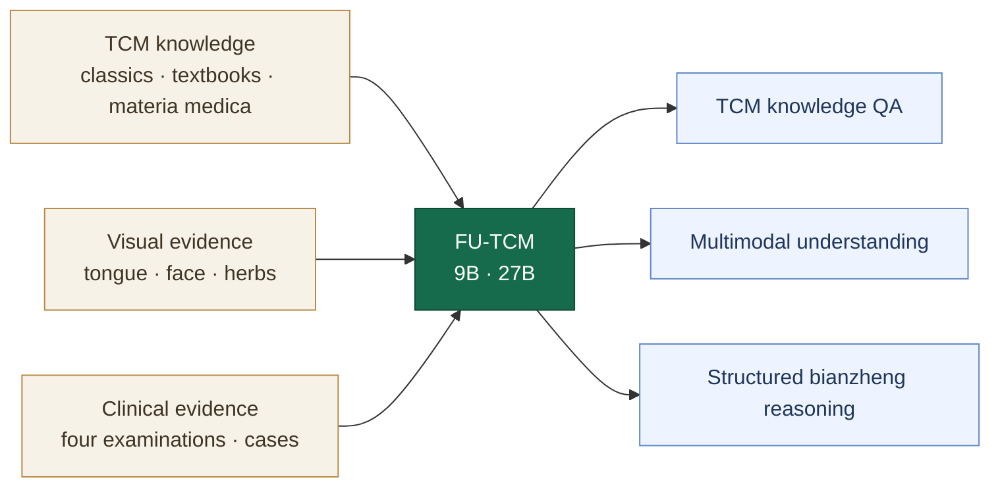

<h1 align="center">Fu-TCM: a multimodal large language model that learns traditional Chinese medicine diagnostic reasoning</h1>

<p align="center">
  🤗 <a href="https://huggingface.co/fudanxai/Fu-TCM-9B">Fu-TCM-9B</a> |
  🤗 <a href="https://huggingface.co/fudanxai/Fu-TCM-27B">Fu-TCM-27B</a>
</p>

## Overview

FU-TCM is a multimodal large-language-model family for Traditional Chinese Medicine (TCM), trained on approximately **7.12 million examples** derived from classical texts, textbooks, medical images, clinical cases, and public datasets. It is designed to connect evidence from the four diagnostic methods to explicit intermediate *bianzheng* fields and a final syndrome prediction.

Training proceeds in two stages. **TCM domain-specific learning** uses text QA, image-text VQA, and case-reasoning examples to establish TCM knowledge, multimodal understanding, and structured reasoning. **Bianzheng-Grounded Policy Optimization (BGPO)** then optimizes response format, tree-based syndrome consistency, and fidelity across 30 intermediate *bianzheng* fields.

<p align="center">
  <a href="assets/fu-tcm-framework-overview.png">
    
  </a>
</p>

<p align="center"><em>FU-TCM framework: multisource data construction, two-stage training, benchmark performance, and external validation.</em></p>

## Key Features

- **From knowledge to *bianzheng*.** Fu-TCM shifts TCM large-model training from knowledge accumulation toward learning how clinical evidence is organized into *bianzheng* decisions.
- **Multimodal four-examination reasoning.** A unified architecture integrates evidence from the four diagnostic methods and generates a complete, traceable evidence-to-syndrome chain for clinician review.
- **Process–outcome evaluation.** A dual-dimensional evaluation system measures both final predictions and the intermediate *bianzheng* process. Fu-TCM achieves state-of-the-art results across six benchmarks and professional-level external validation.
- **Computable and open TCM knowledge.** TCM *bianzheng* experience is encoded as 30 learnable fields and a syndrome taxonomy, while open data, code, and model weights lower the cost of reuse and accelerate international research.

## Results at a glance

FU-TCM-27B led **all six benchmarks** spanning TCM reasoning, text, and vision, with a macro-average accuracy of **81.01%**. Across eight models, mean intermediate-field accuracy correlated positively with final syndrome-choice accuracy (Pearson **r = 0.89**). These results support explicit *bianzheng* supervision as a route toward stronger and more auditable TCM reasoning.

The current evidence is based on retrospective benchmarks and does not establish clinical benefit or autonomous diagnostic safety. FU-TCM is intended for research and practitioner-reviewed decision support.

## Model capabilities



## Training

1. **TCM domain-specific learning** applies full-parameter SFT to text QA, image-text VQA, and case-reasoning examples.
2. **BGPO** reinforces format validity, tree-based syndrome consistency, and fidelity across 30 intermediate diagnostic fields.

The repository currently provides the executable Qwen3.5-9B training path with LLaMA-Factory, DeepSpeed ZeRO-3, bf16, and verl-based policy optimization.

### Start supervised fine-tuning

```bash
git clone https://github.com/HC-Guo/FU-TCM.git
cd FU-TCM/sft_grpo_training_evaluation

bash llamafactory_qwen35/scripts/setup_llamafactory_env.sh
conda activate qwen35_ft
bash llamafactory_qwen35/scripts/train_full_ds3.sh
```

If Conda is unavailable, the setup script creates `.venv_qwen35_ft`; activate that environment before training.

### Run the BGPO/GRPO smoke test

```bash
cd sft_grpo_training_evaluation
bash run_tcm_grpo_smoke.sh
```

## Evaluation

```bash
cd sft_grpo_training_evaluation

# Transformers
TCM_MODEL_PATH=/path/to/FU-TCM python eval_qwen35.py

# vLLM
TCM_MODEL_PATH=/path/to/FU-TCM python eval_qwen35_vllm.py
```

The evaluation utilities report overall, dataset-level, and category-level accuracy. They can also generate blinded question sets and answer sheets for clinician review.

## Core implementation

| Component | Path |
| --- | --- |
| Full-parameter SFT | [`sft_grpo_training_evaluation/llamafactory_qwen35/`](sft_grpo_training_evaluation/llamafactory_qwen35/) |
| BGPO reward implementation | [`sft_grpo_training_evaluation/reward_functions.py`](sft_grpo_training_evaluation/reward_functions.py) |
| Policy-optimization data interface | [`sft_grpo_training_evaluation/convert_bianzheng_to_verl_grpo.py`](sft_grpo_training_evaluation/convert_bianzheng_to_verl_grpo.py) |
| Transformers evaluation | [`sft_grpo_training_evaluation/eval_qwen35.py`](sft_grpo_training_evaluation/eval_qwen35.py) |
| vLLM evaluation | [`sft_grpo_training_evaluation/eval_qwen35_vllm.py`](sft_grpo_training_evaluation/eval_qwen35_vllm.py) |
| Clinician-blinded evaluation | [`sft_grpo_training_evaluation/benchmark_tools/`](sft_grpo_training_evaluation/benchmark_tools/) |

## Documentation

| Guide | Contents |
| --- | --- |
| [Model overview](docs/model_overview.md) | Model family, capabilities, and structured reasoning design |
| [Training overview](docs/training_overview.md) | TCM domain-specific learning, BGPO, and evaluation |
| [Training and evaluation reference](docs/sft_grpo_evaluation.html) | Main configuration and executable entry points |
| [Security policy](SECURITY.md) | Credentials, sensitive data, and responsible disclosure |
