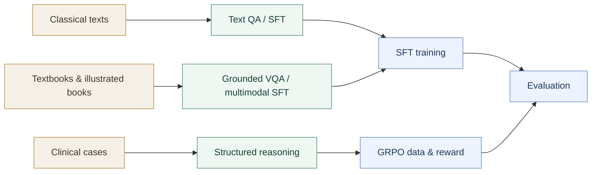

<h1 align="center">FU-TCM</h1>

<p align="center">
  <strong>Traditional Chinese Medicine Data &amp; Training Workflows</strong><br>
  面向中医古籍、教材图文、临床病例推理与模型训练的代码工作流
</p>

<p align="center">
  <a href="https://github.com/HC-Guo/FU-TCM/actions/workflows/repository-hygiene.yml"></a>
  
  
  <a href="SECURITY.md"></a>
</p>

<p align="center">
  <a href="index.html">项目导航</a> ·
  <a href="docs/architecture_overview.md">架构说明</a> ·
  <a href="docs/workflow_overview.md">工作流</a> ·
  <a href="docs/repository_inventory.html">上传与缺失清单</a>
</p>

> [!IMPORTANT]
> 当前分支是 **code-only repository**。训练/测试数据、原始书籍、医学图像、病例、模型权重、生成结果和 benchmark 均不上传 Git；请把它们放在 `.gitignore` 规定的本地目录中。

## Overview

FU-TCM 将中医数据生产、结构化辨证推理、SFT/GRPO 训练准备和评测入口整理为四个相互衔接的模块。仓库只版本化代码、配置、提示词与文档，使私有医学数据和研究产物始终留在本地环境。

### Key features

- **古籍文本 QA**：批量生成、清洗并转换为 SFT 格式。
- **教材与图文 VQA**：支持 PDF 文本 QA、舌诊/面诊/脉诊及中药图文问答。
- **临床辨证推理**：病例抽取、结构化转换、复核及确定性数据切分。
- **训练与评测**：提供 LLaMA-Factory SFT、verl GRPO、规则奖励与 benchmark 工具。
- **仓库治理**：自动阻止数据文件、密钥、绝对路径、非英文路径和缺失关键入口进入 Git。

## Workflow



## Repository layout

| Module | Purpose | Documentation |
| --- | --- | --- |
| `classical_text_qa/` | Classical TCM text QA generation, cleaning and SFT conversion | [Module guide](docs/classical_text_qa.html) |
| `textbook_qa_and_book_vqa/` | Textbook QA, illustrated-book VQA and the customized DataFlow runtime | [Module guide](docs/textbook_qa_and_book_vqa.html) |
| `clinical_case_reasoning/` | Structured syndrome-differentiation conversion and verification | [Module guide](docs/clinical_case_reasoning.html) |
| `sft_grpo_training_evaluation/` | SFT/GRPO preparation, reward functions, training and evaluation | [Module guide](docs/sft_grpo_evaluation.html) |

## Quick start

### Clone and validate

```bash
git clone https://github.com/HC-Guo/FU-TCM.git
cd FU-TCM
python3 scripts/check_repository_hygiene.py
```

### Install one workflow

只安装当前任务所需模块。教材/VQA 模块保留了项目定制的 DataFlow 1.0.10 runtime。

```bash
# Classical text QA
pip install -r classical_text_qa/requirements.txt

# Textbook QA and Book VQA
(
  cd textbook_qa_and_book_vqa/tcm_vision_dataflow
  pip install -r requirements.txt
)

# Clinical case reasoning
pip install -r clinical_case_reasoning/mlzy_reasoning/requirements.txt

# SFT, GRPO and evaluation
pip install -r sft_grpo_training_evaluation/requirements.txt
```

### Configure credentials

复制 `.env.example` 到本地环境文件，仅填写所选工作流需要的变量。不要提交真实密钥。

```bash
export TCM_API_KEY="<your_api_key>"
export DF_API_KEY="<your_api_key>"
export OPENAI_API_KEY="<your_api_key>"
export OPENAI_BASE_URL="<your_api_base_url>"
export OPENAI_MODEL="<your_model>"
```

### Run representative entry points

```bash
# Classical-text QA
python classical_text_qa/scripts/generate/generate_qa_01.py

# Clinical reasoning: extract -> convert -> verify -> split
python clinical_case_reasoning/mlzy_reasoning/scripts/extract/extract_minglaoyishi.py
python clinical_case_reasoning/mlzy_reasoning/scripts/convert/convert_minimax.py
python clinical_case_reasoning/mlzy_reasoning/scripts/verify/verify_mlzy.py
python clinical_case_reasoning/mlzy_reasoning/scripts/prepare/split_dataset.py

# Verified MLZY split -> verl GRPO
cd sft_grpo_training_evaluation
python convert_bianzheng_to_verl_grpo.py \
  --train ../clinical_case_reasoning/mlzy_reasoning/data/processed/bianzheng_mlzy_train.jsonl \
  --test ../clinical_case_reasoning/mlzy_reasoning/data/processed/bianzheng_mlzy_test.jsonl \
  --output-dir verl_data
```

## Local-only data

The main ignored locations are:

```text
classical_text_qa/{source_texts,qa_output,sft_data}/
textbook_qa_and_book_vqa/{sft_data,sft_image_data}/
textbook_qa_and_book_vqa/tcm_vision_dataflow/{source_books,data,results,archives}/
clinical_case_reasoning/{meta_reasoning,mlzy_reasoning}/data/
clinical_case_reasoning/mlzy_reasoning/{source_cases,data_parquet}/
sft_grpo_training_evaluation/{sft_data,sft_image_data,sft_merged,grpodata,verl_data,benchmark}/
```

See [`.gitignore`](.gitignore) for the authoritative list. The repository hygiene Action rejects common dataset and credential patterns if they are accidentally added.

## Documentation

| Guide | Contents |
| --- | --- |
| [Browsable project index](index.html) | Polished HTML navigation for the full repository |
| [Architecture overview](docs/architecture_overview.md) | Separation of versioned code and local research data |
| [Workflow overview](docs/workflow_overview.md) | Main stages, entry points and expected inputs/outputs |
| [Repository inventory](docs/repository_inventory.html) | Retained code, removed data and confirmed missing files |
| [Security policy](SECURITY.md) | Credential and private-data handling rules |

## Validation boundary

Code structure, Python 3.11 syntax, shell/Node syntax, local HTML links and the MLZY → GRPO → reward interface are checked. Full model API generation, private-data processing and distributed GPU/NPU training must still be validated in the target environment.
