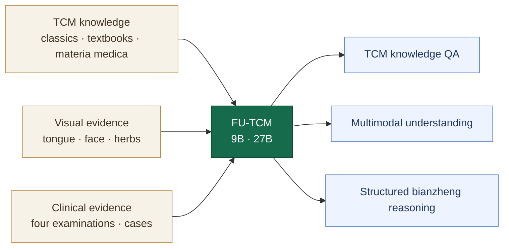

<h1 align="center">FU-TCM</h1>

<p align="center">
  <strong>Advancing Large-Model Capabilities in Traditional Chinese Medicine through Diagnostic-Reasoning Training</strong>
</p>

<p align="center">
  
  
  
  
</p>

<p align="center">
  <a href="index.html">Project page</a> ·
  <a href="docs/model_overview.md">Model overview</a> ·
  <a href="docs/training_overview.md">Training</a> ·
  <a href="docs/sft_grpo_evaluation.html">Evaluation</a>
</p>

## Overview

FU-TCM is a multimodal large-language-model family for Traditional Chinese Medicine (TCM). It is designed to connect evidence from the four examinations to explicit intermediate *bianzheng* judgments and a final syndrome prediction. The model combines TCM knowledge, image-grounded understanding, and structured clinical-case reasoning.

Training proceeds through full-parameter domain supervised fine-tuning, cold-start supervised fine-tuning on structured cases, and Bianzheng-Grounded Policy Optimization (BGPO). BGPO is a TCM-specific policy-optimization objective with verifiable rewards for response format, syndrome consistency, and fidelity to intermediate *bianzheng* fields.

<p align="center">
  <a href="assets/fu-tcm-framework-overview.png">
    
  </a>
</p>

<p align="center"><em>FU-TCM framework, training, and evaluation. This is the overview figure from the paper.</em></p>

## Highlights

- **Two model scales:** FU-TCM-9B and FU-TCM-27B.
- **Multimodal TCM capability:** text and image understanding across classical texts, textbooks, diagnostic images, and clinical cases.
- **Inspectable syndrome differentiation:** a structured path from four-examination evidence through 30 intermediate *bianzheng* fields to the final syndrome.
- **Three-stage training:** domain SFT, cold-start SFT, and BGPO reasoning alignment.
- **Verifiable rewards:** format compliance, syndrome consistency, and intermediate-field fidelity.
- **Six-benchmark evaluation:** case-based *bianzheng*, TCM text knowledge, examination questions, and visual understanding.

## Results at a glance

FU-TCM-27B achieved the highest six-benchmark macro-average accuracy of **80.41%** and ranked first on **five of six** benchmarks. Across eight models, strict intermediate-parameter accuracy correlated with final syndrome-choice accuracy (Pearson **r = 0.81**). These results support explicit *bianzheng* supervision as a route toward more accurate and auditable TCM reasoning.

The current evidence is based on retrospective benchmarks and does not establish clinical benefit or autonomous diagnostic safety. FU-TCM is intended for research and practitioner-reviewed decision support.

## Model capabilities



## Training

1. **Domain SFT** adapts the base vision-language models to TCM text and visual question answering.
2. **Cold-start SFT** teaches the required structured case-reasoning format.
3. **BGPO** reinforces format validity, syndrome consistency, and fidelity across intermediate diagnostic fields.

The repository currently provides the executable Qwen3.5-9B training path with LLaMA-Factory, DeepSpeed ZeRO-3, bf16, and verl-based policy optimization.

### Start supervised fine-tuning

```bash
git clone https://github.com/HC-Guo/FU-TCM.git
cd FU-TCM/sft_grpo_training_evaluation

bash llamafactory_qwen35/scripts/setup_llamafactory_env.sh
conda activate qwen35_ft
bash llamafactory_qwen35/scripts/train_full_ds3.sh
```

If Conda is unavailable, the setup script creates `.venv_qwen35_ft`; activate that environment before training.

### Run the BGPO/GRPO smoke test

```bash
cd sft_grpo_training_evaluation
bash run_tcm_grpo_smoke.sh
```

## Evaluation

```bash
cd sft_grpo_training_evaluation

# Transformers
TCM_MODEL_PATH=/path/to/FU-TCM python eval_qwen35.py

# vLLM
TCM_MODEL_PATH=/path/to/FU-TCM python eval_qwen35_vllm.py
```

The evaluation utilities report overall, dataset-level, and category-level accuracy. They can also generate blinded question sets and answer sheets for clinician review.

## Core implementation

| Component | Path |
| --- | --- |
| Full-parameter SFT | [`sft_grpo_training_evaluation/llamafactory_qwen35/`](sft_grpo_training_evaluation/llamafactory_qwen35/) |
| BGPO reward implementation | [`sft_grpo_training_evaluation/reward_functions.py`](sft_grpo_training_evaluation/reward_functions.py) |
| Policy-optimization data interface | [`sft_grpo_training_evaluation/convert_bianzheng_to_verl_grpo.py`](sft_grpo_training_evaluation/convert_bianzheng_to_verl_grpo.py) |
| Transformers evaluation | [`sft_grpo_training_evaluation/eval_qwen35.py`](sft_grpo_training_evaluation/eval_qwen35.py) |
| vLLM evaluation | [`sft_grpo_training_evaluation/eval_qwen35_vllm.py`](sft_grpo_training_evaluation/eval_qwen35_vllm.py) |
| Clinician-blinded evaluation | [`sft_grpo_training_evaluation/benchmark_tools/`](sft_grpo_training_evaluation/benchmark_tools/) |

## Documentation

| Guide | Contents |
| --- | --- |
| [Model overview](docs/model_overview.md) | Model family, capabilities, and structured reasoning design |
| [Training overview](docs/training_overview.md) | Domain SFT, cold-start SFT, BGPO, and evaluation |
| [Training and evaluation reference](docs/sft_grpo_evaluation.html) | Main configuration and executable entry points |
| [Security policy](SECURITY.md) | Credentials, sensitive data, and responsible disclosure |
